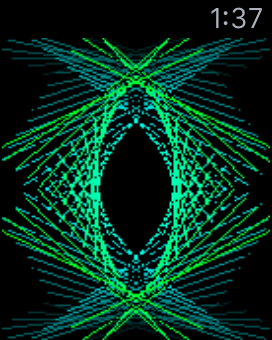

## Lines iOS Watch App

By Carl Gorringe <car1@gorringe.org>

This app demonstrates dynamically generated animations using *CoreGraphics* on an Apple Watch running WatchOS 2.0.

It's based on my first iOS app ***Lines!*** which was released to the App Store in Sept. 2010.  The plan is to update the app so that it'll work on the watch too.

## How It Works

TODO

## License

Copyright (c) 2015 Carl Gorringe. All rights reserved.

Licensed under the the terms of the [GNU General Public License version 3 (GPLv3)](http://www.gnu.org/licenses/gpl-3.0.html).
