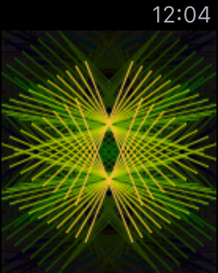
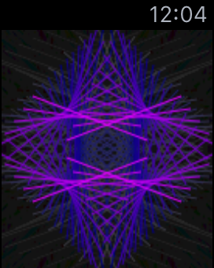
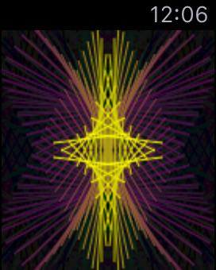
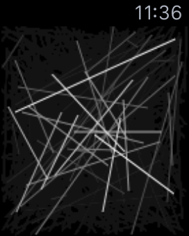

## Lines iOS Watch App

By Carl Gorringe <car1@gorringe.org>

This app demonstrates dynamically generated animations using *CoreGraphics* on an Apple Watch running WatchOS 2.0.

It's based on my first iOS app ***Lines!*** which was released to the App Store in Sept. 2010.  I'll be updating the app so that it'll work on the watch too.


[](https://itunes.apple.com/us/app/lines/id390391751)





## How It Works

Here's how to create your own dynamically generated animation on an Apple Watch.  It'll only work with watchOS 2 due to the fact that we would like the code to run on the watch itself, which isn't available in the first version of watchOS.

First create a WatchKit App in Xcode.  Uncheck the default _Notfication Scene_ unless you wish to keep it.  We'll only need to edit the _InterfaceController_ files.


Add lines to **InterfaceController.h** to look like this:

```objc
#import <WatchKit/WatchKit.h>
#import <Foundation/Foundation.h>
#import <UIKit/UIKit.h>
#import <math.h>

@interface InterfaceController : WKInterfaceController

@property (weak, nonatomic) IBOutlet WKInterfaceImage *mainImg;
@property (assign, nonatomic) CGSize mainSize;
@property (strong, nonatomic) UIImage *linesImg;
@property (strong, nonatomic) NSTimer *linesTimer;

@end
```
Now go to **Interface.storyboard** and add an image (_WKInterfaceImage_) to the watch's interface controller. It should fill the entire area, minus the status bar, which you can't remove. You may change the image's _width_ and _height_ and set them to "Relative to Container" with values of 1. Link it's referencing outlet to `mainImg`.

A _WKInterfaceImage_ doesn't have a frame property, so you cannot query it's size from the code.  We'll want to calculate its size ourselves.  We can retrieve the device's screen size by:

```objc
CGRect rect = [[WKInterfaceDevice currentDevice] screenBounds];
```
The bounds will either be 136 x 170 pts for the 38mm watch, or 156 x 195 pts for the 42mm watch.  The smaller watch's status bar is 19 pts high, and the larger one is 21 pts high, so take these sizes, subtract the status bar height, and that'll give you the rest of the image area's bounds.

```objc
- (CGSize) mainSize {
	// in this case, we assume the higher status bar
	CGRect rect = [[WKInterfaceDevice currentDevice] screenBounds];
	return CGSizeMake(rect.size.width, rect.size.height - 21);
}
```

### How to Create a Dynamically Generated Animation

These are the basic steps:

1. Create an image context to draw in
2. Store this in a UIImage
3. Set this image to the WKInterfaceImage
4. Animate it using a repeating timer

##### Here's the important code:

```objc
- (void) drawTheFrame:(NSTimer *)timer {
	UIGraphicsBeginImageContext(self.mainSize);
	CGContextRef ctx = UIGraphicsGetCurrentContext();
	if (ctx) {
		if (self.linesImg) {
			[self.linesImg drawInRect:CGRectMake(0, 0, self.mainSize.width, self.mainSize.height)];
		}

		// draw on ctx here
	
		self.linesImg = UIGraphicsGetImageFromCurrentImageContext();
		[self.mainImg setImage:self.linesImg];
	}
	UIGraphicsEndImageContext();
}
```
Place your core graphics drawing commands where it says _draw on ctx here_.  For example, to draw a random white line:

```objc
CGContextSetStrokeColorWithColor(ctx, [[UIColor whiteColor] CGColor]);
CGContextSetLineWidth(ctx, 1);
CGContextMoveToPoint(ctx, arc4random_uniform(self.mainSize.width), arc4random_uniform(self.mainSize.height));
CGContextAddLineToPoint(ctx, arc4random_uniform(self.mainSize.width), arc4random_uniform(self.mainSize.height));
CGContextStrokePath(ctx);
```
To add a fading out effect to the image, replace the `drawInRect` call above with this version:

```objc
[self.linesImg drawInRect:CGRectMake(0, 0, self.mainSize.width, self.mainSize.height) blendMode:kCGBlendModeNormal alpha:0.95];
```
Now start your timer in _willActivate_:

```objc
- (void) willActivate {
	// This method is called when watch view controller is about to be visible to user
	[super willActivate];
	// start the animation
	if (!self.linesTimer) {
		self.linesTimer = [NSTimer scheduledTimerWithTimeInterval: 0.05f
		                                                   target: self
			                                             selector: @selector(drawTheFrame:)
		                                                 userInfo: nil
		           	                                      repeats: YES ];
		}
	}
```

Don't forget to stop the timer in _didDeactivate_:

```objc
- (void) didDeactivate {
	// This method is called when watch view controller is no longer visible
	if (self.linesTimer) {
		[self.linesTimer invalidate];
		self.linesTimer = nil;
	}
	[super didDeactivate];
}
```


Run the app under the watch simulator, and see how it looks!



### That's It!

_____

## License

Copyright (c) 2015 Carl Gorringe. All rights reserved.

Licensed under the the terms of the [GNU General Public License version 3 (GPLv3)](http://www.gnu.org/licenses/gpl-3.0.html).
